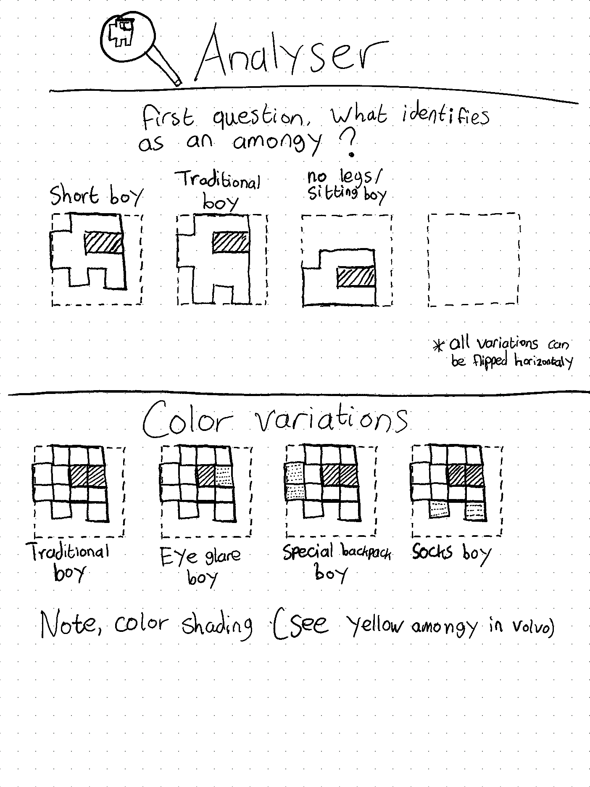

    <h1>AmongyAnalyser</h1>
    

## r/place
Originally created for r/place. This app searches for amongy in pixel art. Created in pure HTML5, CSS and JavaScript.

## Current status
- [x] Base system identifying the shape
- [ ] Color variations inside amongy
- [x] Explorable canvas (zoom and move)
- [ ] Show statistics (how many of which amongy)
- [x] Launch github pages
- [ ] Use worker for analyser *(https://developer.mozilla.org/en-US/docs/Web/API/Web_Workers_API/Using_web_workers)*

## Thought process

    

